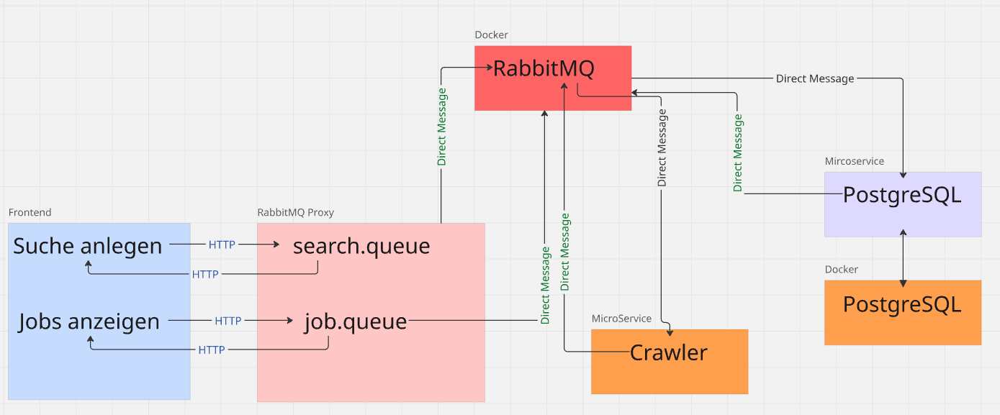

# Jobhafen

> **Jobhafen** ist eine Webapplikation, die verschiedene Jobportale zentral durchsucht. Jobsuchende bekommen *eine* übersichtliche Plattform für die Stellensuche. *Ciao* zu lästigem Anmelden,  *Ciao* zu Dupikaten über mehrere Portale. Individuell und privat.

---

## 📋 Agenda

1. [Java PostgreSQL Service](#-java-crawler)
2. [Über das Projekt](#-über-das-projekt)
3. [Architektur](#-architektur)
4. [Vision](#-vision)
---

## 📂 Java Crawler

Ein PostgreSQL Service, der mit der DB verbunden ist. Der Service ist für alle Operationen an der DB verantwortlich.

Es wird *Maven* verwendet mit **Spring-Boot** verwendet.
```mvn spring-boot:run```
---

## 📌 Über das Projekt

**Jobhafen** ist eine hybride Webapplikation, die Jobsuchenden eine* zentrale* Anlaufstelle für die Suche nach Stellenangeboten bieten soll.

Das Ziel von Jobhafen ist es, die größten Jobportale automatisiert zu durchsuchen, die gefundenen Stellenangebote zentral zusammenzuführen und übersichtlich darzustellen.

Dadurch müssen Jobsuchende nicht mehr mehrere Jobportale einzeln durchsuchen,einzel anmelden und Duplikate händisch aussortieren, sondern können sich voll und ganz auf ihre Jobsuche konzentrieren.

Jobhafen verfolgt damit das Ziel, die Jobsuche **zentraler, übersichtlicher und effizienter** zu gestalten.

P.S.💅 Ich bin der Meinung, dass wir( als User) nicht mehrere Portale, mehrere Paywalls und mehrere Accounts brauchen, um am Ende redundante Informationen; in diesem Fall Jobs, zu bekommen, die man auch auf der Karriere-Seite der jeweiligen Firma bekommen kann.

---

## 🏗️ Architektur

Jobhafen basiert auf einer **hybriden Microservice Architektur**, bei der unterschiedliche Technologien für Frontend und Backend eingesetzt werden. Es gibt mehrere Microservices, die mittels RabbitMQ miteinander kommunizieren. Aufgrund der hohen Diversität von Frontend-Frameworks kommuniziert das FE **nicht** mit RabbitMQ direkt, sondern schickt über HTTPS-Request seine Anfragen an einen **Proxy**. Dieser Proxy erinnert an eine milde Ausprägung eines Orchestrators, wobei hierbei das SAGA-Pattern nicht explizit, aber doch im philosophischen Gedankenmodell implementiert wurde d.h. der Proxy verwaltet Kommunikationsketten.

Durch dieses Fundament ist die Architektur  Stack-agnostisch. Jedes Feature kann durch einen Microservice implementiert werden, jeder Baustein kann ersetzt werden, da die Kommunikation durch RabbitMQ stattfindet.

Primär werden DirectMessages verwendet mit dem AMQ-Protokoll.



Das Frontend wird vollständig mit **TypeScript** umgesetzt. Für die Benutzeroberfläche existieren in **React** und **Angular**; die beiden beliebtesten FE-Frameworks. Wie schon erwähnt kann jedes FE verwendet werden; auch Android oder iOS.

Das Backend basiert auf **Java mit Spring-Boot**.

Für die Kommunikation zwischen einzelnen Komponenten wird **RabbitMQ** eingesetzt. **PostgreSQL** dient als relationale Datenbank zur persistenten Speicherung der Daten; beide laufen im Docker Container. Die Images können im Dockerhub runtergeladen werden.

Es werden die neuesten Versionen verwendet d.h.
* Java 25 SE mit Spring-Boot
* Angular 22 als Typerscript-Variante
---


## 🚀 Vision

Jobhafen soll euch die Jobsuche erleichtern. :hugs: 

